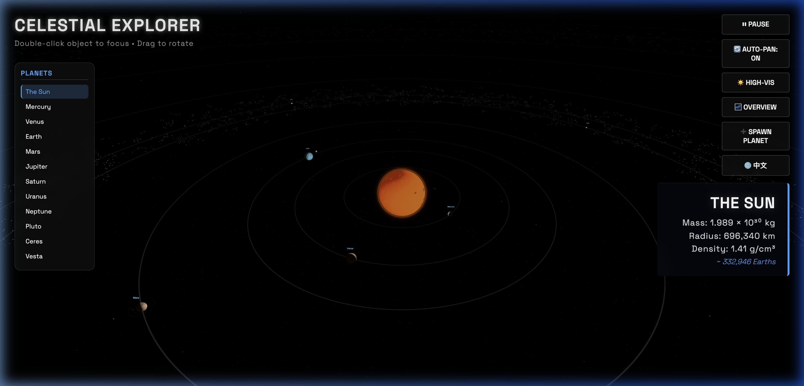
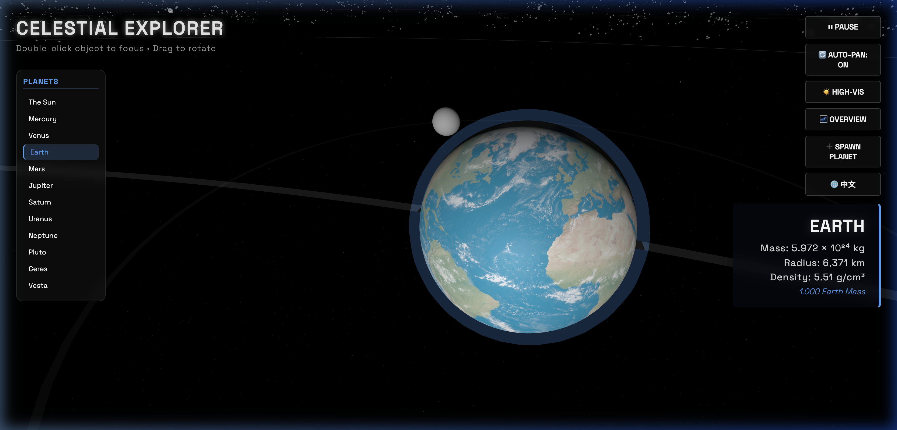
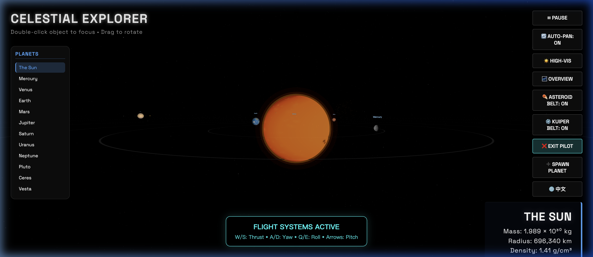

# 🌌 Celestial Explorer | 星空探索者

[](https://opensource.org/licenses/MIT)
[](https://threejs.org/)

**Celestial Explorer** is a high-fidelity, interactive 3D solar system simulation built with Three.js. It combines physically plausible orbital mechanics with modern web performance optimizations, offering an immersive educational and visual experience.

**星空探索者** 是一款基于 Three.js 开发的高精度、交互式 3D 太阳系模拟系统。它将真实的轨道物理力学与现代 Web 性能优化技术相结合，为用户提供身临其境的科普与视觉体验。



---

## 🚀 Key Features | 核心功能

### 🎮 Spaceship Pilot Mode (6DOF) | 飞船驾驶模式
Take command of a stylized sci-fi spaceship. The simulation features a fully controllable flight engine:
驾驶一艘充满科幻感的飞船。模拟器配备了完整的飞行引擎：
- **6 Degrees of Freedom**: Pitch, Yaw, Roll, and Thrust control.
- **6 自由度操控**：支持俯仰、偏航、翻滚及推进控制。
- **Chase Camera**: A dynamic follow-camera system for an immersive piloting experience.
- **追逐摄像机**：动态跟随系统，提供沉浸式的驾驶感。
- **Interplanetary Travel**: Seamlessly detach from Earth's orbit and fly across the solar system.
- **星际航行**：无缝脱离地球轨道，在全局坐标系中自由探索太阳系。

### ⚛️ Real-Time Physics | 实时物理引擎
- **Newtonian Gravity**: Realistic orbital calculations for planets, moons, and thousands of asteroids.
- **牛顿万有引力**：针对行星、卫星及数千颗小行星的真实轨道计算。
- **Collision Merging**: Bodies that collide will physically merge, combining their mass and volume.
- **碰撞融合**：天体碰撞后会实时合并质量与体积。

### ⚡ Performance Optimizations | 性能优化
- **Multi-Tier Resolution**: Automatic texture resolution swapping (Ultra-Low, Low, High).
- **多级分辨率**：根据设备性能自动切换贴图精度（极低、低、高）。
- **Lazy Loading**: Assets are fetched on-demand when an object is focused.
- **延迟加载**：仅在物体被聚焦时才按需加载高清资源，大幅提升首屏速度。
- **Belt Toggles**: Toggle the Asteroid and Kuiper belts on/off to boost frame rates.
- **星带开关**：可随时开启/关闭小行星带和柯伊伯带，优化低配设备运行。

### 🌍 Localization & UI | 本地化与界面
- **Full Bilingual Support**: Toggle between English and Chinese (🌐 中文) at any time.
- **双语支持**：随时在中英文界面之间切换。
- **Deep Focus Mode**: Double-click any planet or moon to view detailed scientific data.
- **深度聚焦**：双击任一天体即可查看详细的科学观测数据。

---

## 📸 Screenshots | 画面展示

| Focused Exploration | Spaceship HUD |
| :---: | :---: |
|  |  |

---

## 🛠️ Technology Stack | 技术栈

- **Core Engine**: [Three.js](https://threejs.org/) (WebGL)
- **Styling**: Vanilla CSS (Modern patterns, glassmorphism)
- **Logic**: Vanilla JavaScript (ES6+ Modules)
- **Assets**: 1k-4k Planetary Textures & Procedural Starfields.

---

## ⌨️ Controls | 操作指南

### Simulation Controls | 模拟器控制
| Action | 动作 | Input | 按键 |
| :--- | :--- | :--- | :--- |
| **Rotate Camera** | 旋转镜头 | Left Click + Drag | 左键拖拽 |
| **Pan Camera** | 平移镜头 | Right Click + Drag | 右键拖拽 |
| **Zoom In/Out** | 放大/缩小 | Scroll Wheel | 鼠标滚轮 |
| **Focus Object** | 聚焦天体 | Double Click | 双击天体 |
| **Reset View** | 重置视角 | Click "Overview" | 点击“系统全貌” |

### 🚀 Flight Controls (Pilot Mode) | 飞行操控 (驾驶模式)
| Action | 动作 | Input | 按键 |
| :--- | :--- | :--- | :--- |
| **Thrust (Forward/Back)** | 推进（前/后） | `W` / `S` | `W` / `S` |
| **Yaw (Left/Right)** | 偏航（左/右） | `A` / `D` | `A` / `D` |
| **Roll (Rotate)** | 翻滚（旋转） | `Q` / `E` | `Q` / `E` |
| **Pitch (Up/Down)** | 俯仰（上/下） | `Arrow Up` / `Down` | `↑` / `↓` |
| **Turbo Boost** | 涡轮增压 | `Shift` (Hold) | `Shift` (长按) |

---

## 📥 Getting Started | 快速开始

1. **Clone the repository | 克隆仓库**:
   ```bash
   git clone https://github.com/zacario-li/Celestial-Explorer.git
   ```

2. **Run a local server | 启动本地服务**:
   ```bash
   npx serve .
   ```

3. **Open in Browser | 浏览器访问**:
   Navigate to `http://localhost:3000`.

---

## 📜 License | 开源协议
Distributed under the MIT License. See `LICENSE` for more information.

---

*Made with ✨ by the Celestial Explorer team.*
